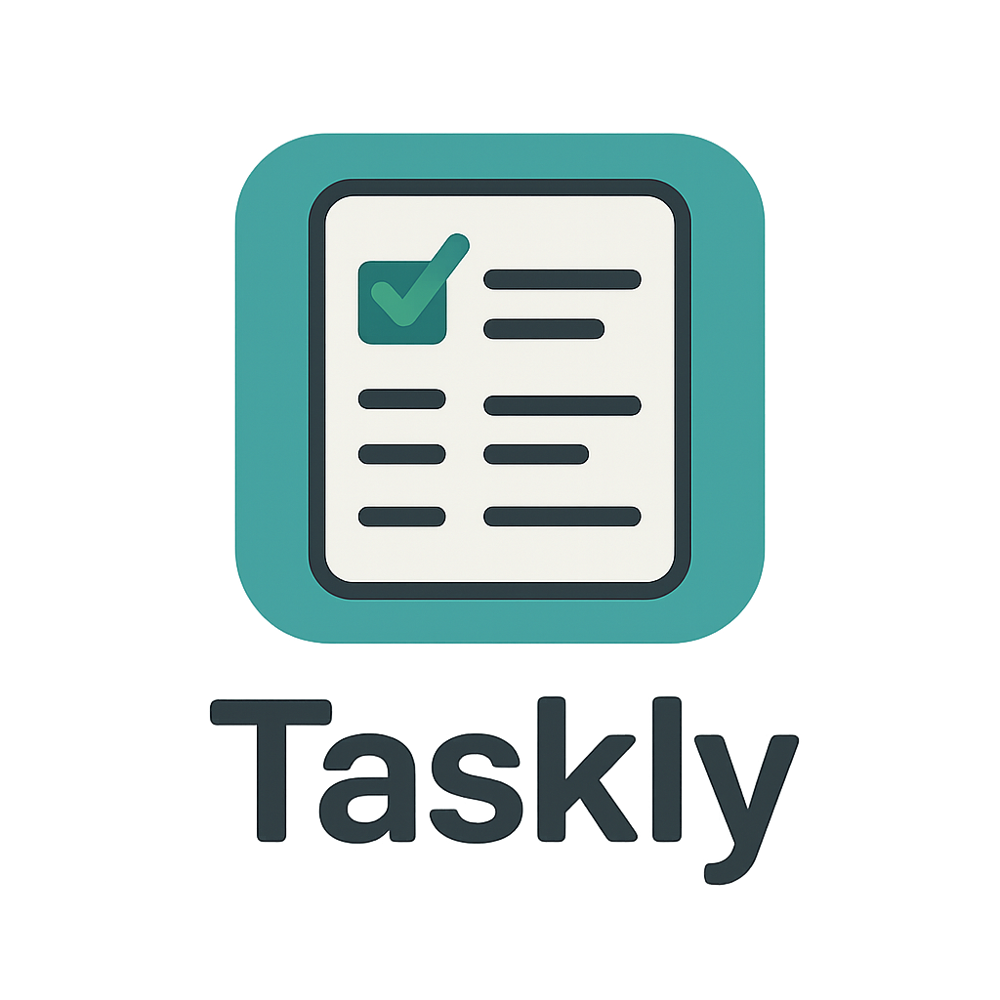

<div align="center">
  
  <p><strong>Built for doing — not for deciding what to do.</strong></p>
</div>

# Taskly

✨ A stunning, responsive task management API. Built with **C#** and **.NET 9** on the backend, featuring seamless
authentication with **Auth0** and cloud-native architecture with **.NET Aspire**.

---

## 🎯 Features

- **🔐 Secure Authentication** — Auth0 JWT-based authentication and authorization
- **👥 Role-Based Access Control** — Admin and User policies for endpoint protection
- **📦 RESTful API** — Clean, feature-driven architecture with CQRS patterns
- **💾 Data Persistence** — PostgreSQL database with Entity Framework Core
- **📂 File Storage** — Azure Blob Storage with secure SAS URLs for attachments
- **📧 Email Reminders** — Background reminder service for todo notifications
- **🧪 Comprehensive Testing** — Integration and unit tests with mock infrastructure
- **☁️ Cloud-Native** — Built with .NET Aspire for easy cloud deployment
- **📖 Interactive API Docs** — Scalar UI for API exploration

---

## 🚀 Quick Start

### Prerequisites

- **.NET 9 SDK** — [Download](https://dotnet.microsoft.com/download/dotnet/9.0)
- **Docker Desktop** — [Download](https://www.docker.com/products/docker-desktop)
- **Python 3.8+** _(optional)_ — [Download](https://www.python.org/downloads/)
- **Auth0 Account** — [Sign up free](https://auth0.com/signup)

### Setup in 4 Steps

```bash
# 1. Clone the repository
git clone https://github.com/taner04/Taskly

# 2. Initialize the project
python3 .\scripts\setup.py

# 3. Configure Auth0 credentials in:
#    - appsettings.json (SPA credentials)

# 4. Run the API
dotnet run --project .\tools\AppHost
```

See [Setup Guide](docs/SETUP.md) for detailed setup instructions.

---

## 🛠️ Tech Stack

| Layer              | Technology                        |
|--------------------|-----------------------------------|
| **Backend**        | .NET 9, ASP.NET Core, C#          |
| **Database**       | PostgreSQL, Entity Framework Core |
| **Authentication** | Auth0, JWT Bearer                 |
| **File Storage**   | Azure Blob Storage                |
| **Email Service**  | MailKit                           |
| **Infrastructure** | Docker, .NET Aspire               |
| **Testing**        | xUnit, Refit, Integration Tests   |

---

## 📚 Documentation

- **[Setup Guide](docs/SETUP.md)** — Step-by-step setup instructions
- **[Architecture](docs/ARCHITECTURE.md)** — System design and component interactions
- **[Scripts Guide](docs/SCRIPTS.md)** — Python automation scripts
- **[Contributing Guide](docs/CONTRIBUTING.md)** — Development workflow and guidelines
- **[License](LICENSE.md)** — GNU Lesser General Public License v3.0

---

## 📁 Project Structure

```
Taskly/
├── docs/                 # Documentation
├── scripts/              # Python automation scripts
├── src/
│   └── Api/              # ASP.NET Core API
│   └── ReminderService/  # Email service
├── tests/
│   ├── IntegrationTests/ # Integration tests
│   └── UnitTests/        # Unit tests
└── tools/
    ├── AppHost/          # .NET Aspire orchestration
    ├── MigrationService/ # Database migrations
    └── ServiceDefaults/  # Shared configuration
```

---

## 🤝 Contributing

We welcome contributions! Please see our [Contributing Guide](docs/CONTRIBUTING.md) for:

- Development setup
- Code guidelines
- Pull request process
- Reporting issues

---

## 📄 License

GNU Lesser General Public License v3.0 — see [LICENSE.md](LICENSE.md)
