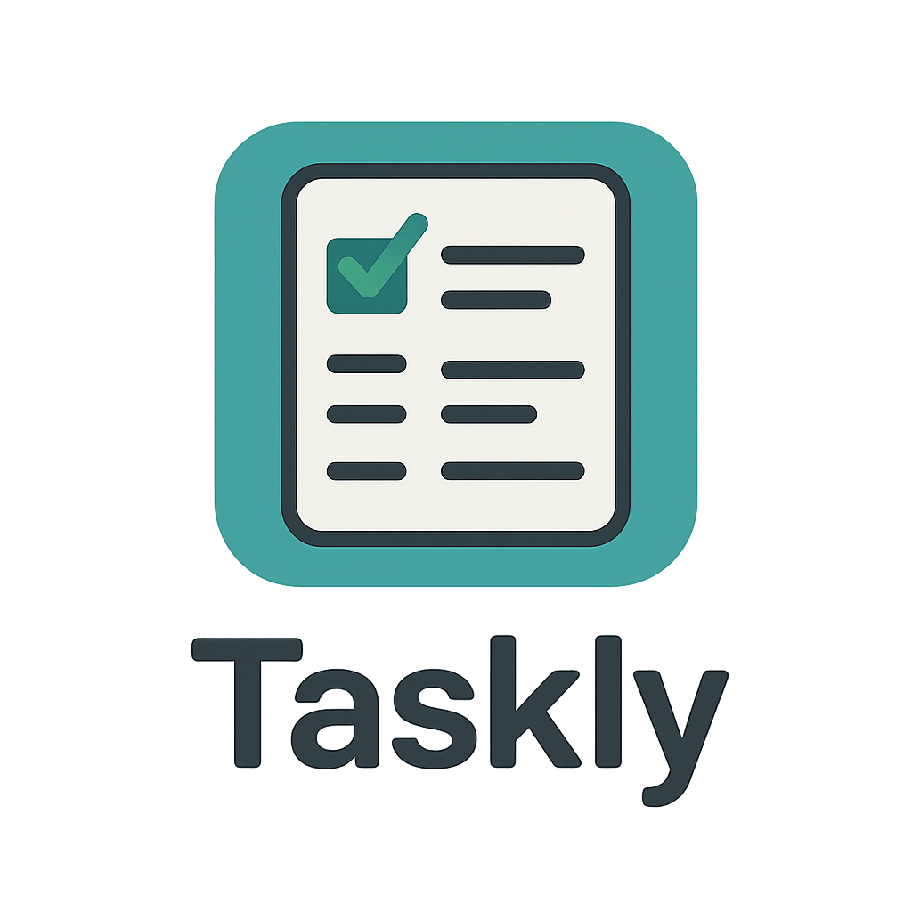

<div align="center">
  
  <p><strong>Built for doing — not for deciding what to do.</strong></p>
</div>

# Taskly

✨ A stunning, responsive task management API. Built with **C#** and **.NET 10** on the backend, featuring seamless
authentication with **Auth0** and cloud-native architecture with **.NET Aspire**.

---

## 🎯 Features

- **🔐 Secure Authentication** — Auth0 JWT-based authentication and authorization
- **👥 Role-Based Access Control** — Admin and User policies for endpoint protection
- **📦 RESTful API** — Clean, feature-driven architecture with CQRS patterns
- **💾 Data Persistence** — PostgreSQL database with Entity Framework Core
- **📂 File Storage** — Azure Blob Storage with secure SAS URLs for attachments
- **📉 Event Webhooks** — Webhook-based attachment upload completion with secure secret key validation
- **📧 Email Reminders** — Hangfire-scheduled reminder emails via SMTP
- **🧪 Comprehensive Testing** — Integration tests with real database context
- **☁️ Cloud-Native** — Built with .NET Aspire for easy cloud deployment
- **📖 Interactive API Docs** — Scalar UI for API exploration

---

## 📋 Requirements

- **.NET 10 SDK** — [Download](https://dotnet.microsoft.com/download/dotnet/10.0)
- **Docker Desktop** — [Download](https://www.docker.com/products/docker-desktop)
- **Auth0 Account** — [Sign up free](https://auth0.com/signup)

---

## 🚀 Getting Started

### 1. Clone Repository

```bash
git clone https://github.com/taner04/Taskly
cd Taskly
```

### 2. Configure Auth0

1. Go to [Auth0 Dashboard](https://manage.auth0.com/)
2. Create a **Single Page Web Application**
3. Create an **API** in Auth0 and set the **Identifier** (Audience)
4. Copy **Domain**, **Client ID**, **Client Secret**, and **API Audience**
5. Set the following URLs in Auth0 application settings:
    - **Allowed Callback URLs**: `https://localhost:{PORT}/scalar/v1/oauth2-redirect.html`
    - **Allowed Logout URLs**: `https://localhost:{PORT}/scalar/v1`

### 3. Create appsettings.json

Create `src/Taskly.WebApi/appsettings.json` with the following template:

```json
{
  "Logging": {
    "LogLevel": {
      "Default": "Information",
      "Microsoft.AspNetCore": "Warning"
    }
  },
  "AllowedHosts": "*",
  "Auth0Config": {
    "Domain": "your-auth0-domain",
    "Audience": "your-auth0-audience",
    "ClientId": "your-auth0-client-id",
    "ClientSecret": "your-auth0-client-secret",
    "UsePersistentStorage": false
  },
  "ConnectionStrings": {
    "AzureBlobStorage": "your-azure-blob-storage-connection-string"
  },
  "WebHookConfig": {
    "SecretKey": "your-webhook-secret-key"
  },
  "EmailConfig": {
    "Host": "localhost",
    "Port": 25
  }
}
```

### 4. Run Application

```bash
dotnet run --project ./tools/Taskly.AppHost
```

The API will be available at `https://localhost:{PORT}/scalar/v1` with interactive API documentation.

---

## 🛠️ Tech Stack

| Layer              | Technology                        |
|--------------------|-----------------------------------|
| **Backend**        | .NET 10, ASP.NET Core, C#         |
| **Database**       | PostgreSQL, Entity Framework Core |
| **Authentication** | Auth0, JWT Bearer                 |
| **File Storage**   | Azure Blob Storage                |
| **Email Service**  | MailKit, Hangfire                 |
| **Infrastructure** | Docker, .NET Aspire               |
| **Testing**        | xUnit, Refit, Integration Tests   |

---

## 📁 Project Structure

```
Taskly/
├── docs/                        # Documentation
├── src/
│   ├── Taskly.Desktop/          # WPF Desktop Client (IN PROGRESS)
│   ├── Taskly.WebApi/           # ASP.NET Core API
│   ├── Taskly.Shared/           # Shared utilities
│   └── Taskly.WebApi.Client/    # API client library
├── tests/
│   └── Taskly.IntegrationTests/ # Integration and unit tests
└── tools/
    ├── Taskly.AppHost/          # .NET Aspire orchestration
    ├── Taskly.MigrationService/ # Database migrations
    └── Taskly.ServiceDefaults/  # Shared configuration
```

## 📄 License

GNU Lesser General Public License v3.0 — see [LICENSE.md](LICENSE.md)
