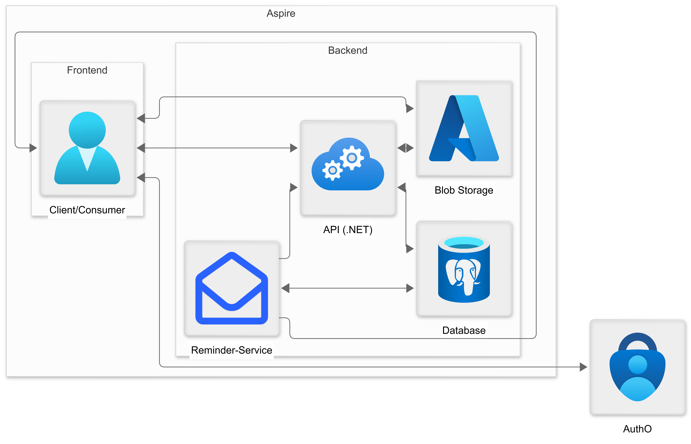

# Architecture

## 🔗 Component Interaction

The request flow follows this architecture:

1. **Client** → Requests a token from **Auth0** using client credentials
2. **Auth0** → Returns a JWT token to the client
3. **Client** → Sends API request with JWT token to the **API**
4. **API** → Validates the token and processes the request
5. **API** → Queries or updates data in the **Database**
6. **API** → For file uploads/downloads, generates signed URLs to **Azure Blob Storage**
7. **Client** → Uses the signed URL to upload/download files directly to/from **Azure Blob Storage**
8. **API** → Returns the response to the client
9. **Hangfire Jobs** → Scheduled reminder jobs execute at configured times and send email reminders via SMTP

---

## 🏗️ Technology Stack

### Backend

- **.NET 10** — Modern C# runtime with nullable reference types
- **Entity Framework Core** — ORM with PostgreSQL provider
- **ASP.NET Core** — Web framework with minimal APIs
- **Auth0** — JWT-based authentication and authorization
- **Azure Blob Storage** — Cloud file storage with SAS URLs
- **MailKit** — SMTP client for sending email reminders
- **Hangfire** — Persistent job scheduler for reminder emails
- **Immediate.Apis** — For easily mapping handlers to endpoints
- **Immediate.Validations** — For model validation
- **Immediate.Handlers** — For implementing the Command and Query Responsibility Segregation (CQRS) pattern with minimal
  boilerplate
- **Vogen** — Strongly-typed value object code generation
- **Refit** — Type-safe HTTP client generation

### Infrastructure

- **PostgreSQL** — Relational database
- **Azure Blob Storage** — Scalable file storage for attachments
- **Docker** — Containerization
- **.NET Aspire** — Cloud-native orchestration
- **Python 3** — Automation scripts

---

## 🔐 Authentication & Authorization

### JWT Bearer Authentication

- **Token Validation**: JWT Bearer scheme applied to all protected endpoints
- **User Context**: User ID extracted from JWT claims and scoped to all requests

### OpenAPI Integration

- Dual security schemes: JWT Bearer + OAuth2 (Authorization Code Flow)
- Bearer token scheme configured for interactive Scalar UI testing
- Auth0 credentials dynamically injected via configuration

---

## 📚 Key Features

- **Authentication** — Seamless Auth0 integration with JWT validation
- **Feature-organized structure** — Code organized by business features
- **Email Reminders** — Hangfire-based scheduled reminder emails via SMTP
- **Testing** — Comprehensive integration and unit tests
- **Cloud-native ready** — Built with .NET Aspire for cloud deployment
- **Error Handling** — RFC 7807 Problem Details for standardized error responses
- **File Storage** — Secure Azure Blob Storage with pre-signed SAS URLs
- **Auditing** — Automatic tracking of who created/modified data and when
